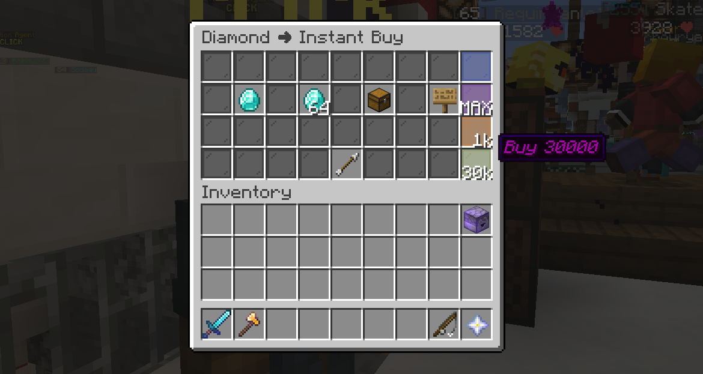
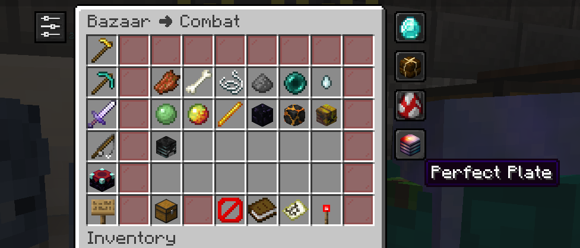
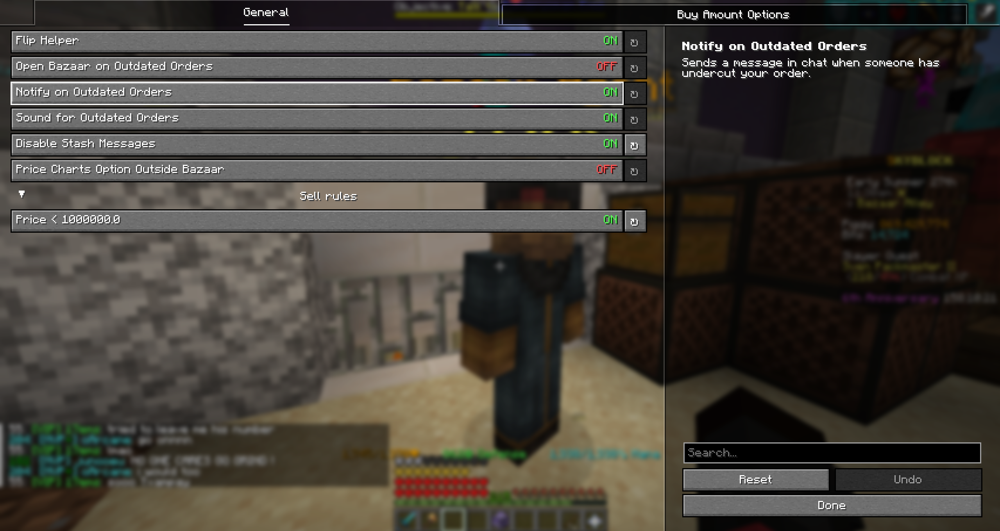
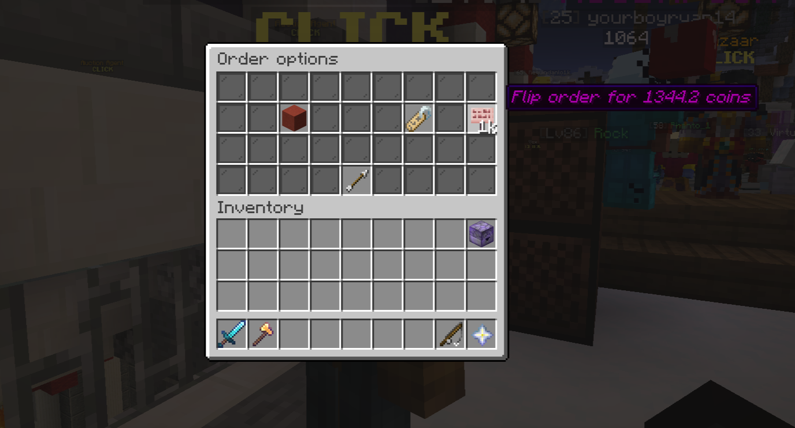
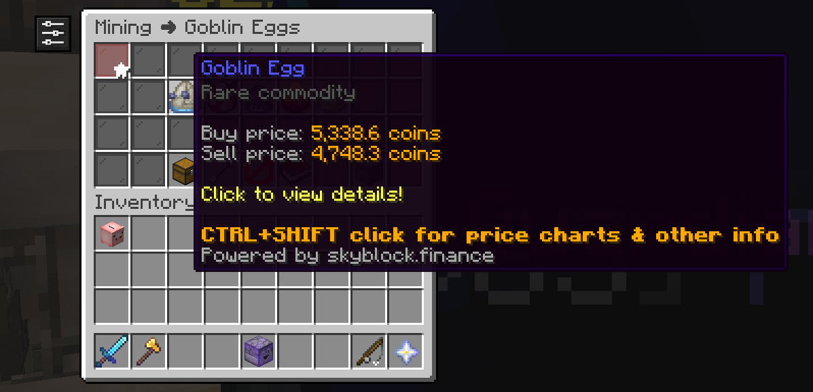
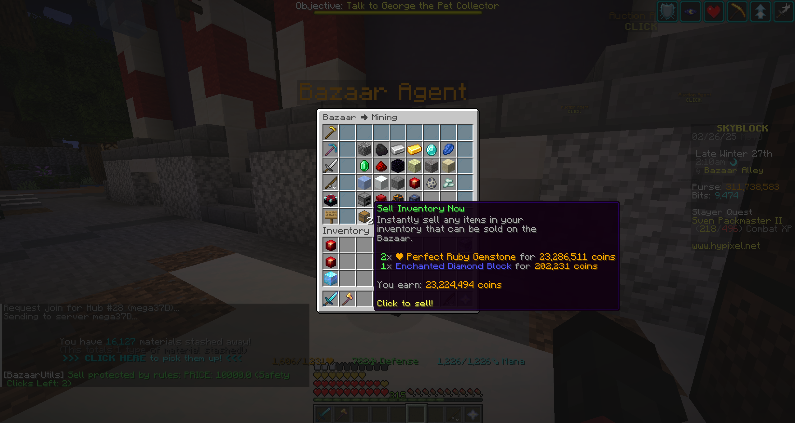

# Bazaar Utils

## 🔍Features

-   **Custom Orders**: Create buttons in the buy order and insta buy menu for options of different buy amountss.
-   **Insta Sell Rules**: Prevent accidental insta selling by requiring multiple clicks based on price, volume, or item name restrictions you choose.
-   **Flip Helper**: Adds a button in the flip GUI to easily flip order at market price.
-   **Outdated Item Notifications**: Receive chat alerts when an order is undercut, click the message to open the bazaar.
-   **Stash Helper**: Keybind (default ALT + V) to close GUIs and pick up your stash.
-   **Disable Stash Messages**: Option to turn off chat reminders to pick up your stash.
-   **Bookmarks**: Easily search for bookmarked items from the main Bazaar menu.
-   **Price Charts**: CTRL+SHIFT + click an item in the Bazaar to open its skyblock.finance page.

<strong>🖼️ Gallery</strong>

**Custom Orders**

_Create custom order buttons (the glass panes on the right) which are shortcuts to buying a set amount of an item in buy orders or insta buy._

**Bookmarks**

_Bookmarks for items in the bazaar. When you open the main page of the bazaar, you will see your bookmarks on the right. Clicking one will search for that item. To create a bookmark, you can click the button in the top left when you are in an item's page._

**Settings General Page**

**Flip Helper**

_Makes button (the cherry sign) that you can click to flip your order, undercutting the market price by .1 coin._

**Price Charts**

_Ctrl+Shift click an item in the bazaar to open that item's skyblock.finance page. There is a confirmation screen before you are redirected._

**Sell Rules**

_Create rules which stop you from insta selling items in your inventory. Ex: I can make a rule for "diamond" and a rule for price <100,000, and it would require three clicks to sell your inventory if you have diamonds or the items cost > 100,000._

## ❓Using Bazaar Utils

REMEMBER -- if your bazaar flipper account upgrade is not level one, change your bazaar tax with /bazaarutils tax or the mod wont work right
##### To open the mod config use `/bazaarutils` or `/bu`.

<strong>🧾Other Commands</strong>

- `/bu customorder add {order amount} {slot number}` \_(top left slot is slot #1, to the right is #2, etc etc)\_
- `/bu customorder remove {order number}` \_(the order it is shown in config)\_
- `/bu rule add {based on volume, price or item name} {amount over which will be restricted}\`
- `/bu rule remove {rule number}`
- `/bu developer` \_(to enable developer settings, you probably wont use this)\_

## 🧩Dependencies

<strong>🔗Must Have in Mods Folder</strong>

- Fabric API (you probably already have this https://modrinth.com/mod/fabric-api)
- Yet Another Config Library (https://modrinth.com/mod/yacl)

<strong>✨Optional (But Recommended)</strong>

- Amecs Reborn (https://modrinth.com/mod/amecs-reborn)
- Mod Menu (https://modrinth.com/mod/modmenu)

<strong>📦Included in Mod Already</strong>

- Orbit Event System (helps in mod development)
- Mixin Constructs (helps in mod development)
- Hypixel API Transport (for getting bazaar data)
- Hypixel API Core (for getting bazaar data)

